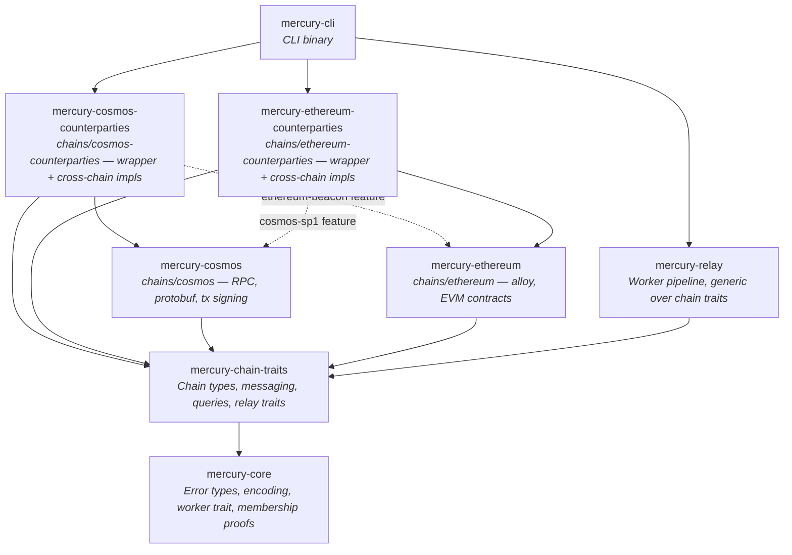
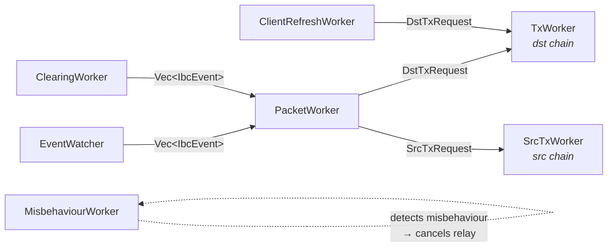

# Architecture

Mercury is an IBC relayer built with plain Rust traits and generics. No macro frameworks, no code generation, no custom programming paradigms.

## Design Principles

- **Direct trait impls.** Every chain operation is a trait method with a direct `impl` block on the concrete type. No provider indirection.
- **Few, focused traits.** ~21 traits grouped by concern instead of 250+ component traits. Type traits are consolidated — `ChainTypes` carries all chain-level types (height, timestamp, client ID, messages, chain status) and `IbcTypes` carries all IBC-specific types (client state, packets, proofs, acknowledgements). This keeps where clauses short and avoids the "trait per associated type" proliferation that CGP requires.
- **Plain `eyre` errors.** `eyre::Result<T>` everywhere. No generic error parameters on traits, no custom error wrapper.
- **Struct fields, not trait getters.** Configuration and RPC clients are struct fields accessed via methods. Not abstracted behind traits.

## Trait Hierarchy

### Type Traits

```rust
pub trait ChainTypes: ThreadSafe {
    type Height: Clone + Ord + Debug + Display + ThreadSafe;
    type Timestamp: Clone + Ord + Debug + ThreadSafe;
    type ChainId: Clone + Debug + Display + ThreadSafe;
    type ClientId: Clone + Debug + Display + ThreadSafe;
    type Event: Clone + Debug + ThreadSafe;
    type Message: ThreadSafe;
    type MessageResponse: ThreadSafe;
    type ChainStatus: ThreadSafe;

    fn chain_status_height(status: &Self::ChainStatus) -> &Self::Height;
    fn chain_status_timestamp(status: &Self::ChainStatus) -> &Self::Timestamp;
    fn chain_status_timestamp_secs(status: &Self::ChainStatus) -> u64;
    fn revision_number(&self) -> u64;
    fn increment_height(height: &Self::Height) -> Option<Self::Height>;
    fn sub_height(height: &Self::Height, n: u64) -> Option<Self::Height>;
    fn block_time(&self) -> Duration;
}
```

`ThreadSafe` is `Send + Sync + 'static` — a marker trait defined in `mercury-core`.

### Non-Generic IBC Types

Unlike the original design that parameterized `IbcTypes` over a counterparty chain, Mercury's `IbcTypes` is a plain supertrait of `ChainTypes` with no generic parameter:

```rust
pub trait IbcTypes: ChainTypes {
    type ClientState: Clone + Debug + ThreadSafe;
    type ConsensusState: Clone + Debug + ThreadSafe;
    type CommitmentProof: Clone + ThreadSafe;
    type Packet: Clone + Debug + ThreadSafe;
    type PacketCommitment: ThreadSafe;
    type PacketReceipt: ThreadSafe;
    type Acknowledgement: ThreadSafe;

    fn packet_sequence(packet: &Self::Packet) -> u64;
    fn packet_timeout_timestamp(packet: &Self::Packet) -> u64;
    fn packet_source_ports(packet: &Self::Packet) -> Vec<String>;
}
```

Making `IbcTypes` non-generic is a deliberate choice. In the generic approach (`IbcTypes<Counterparty>`), adding a new counterparty chain requires implementing `IbcTypes<NewChain>` — which in practice always uses the same types. Cosmos IBC types don't change based on whether the counterparty is another Cosmos chain or an EVM chain. Removing the generic parameter eliminates this redundancy and, critically, eliminates the circular dependency problem entirely (see [Cross-Chain Architecture](#cross-chain-architecture)).

### Wrapper Pattern: HasInner + `delegate_chain_inner!`

Cross-chain relaying between different chain types (Cosmos↔EVM) hits Rust's orphan rule: the EVM counterparty crate can't implement Cosmos traits for the Cosmos type, and vice versa. Mercury solves this with a wrapper pattern.

Each chain has two types:
- **Inner type** (e.g., `CosmosChainInner<S>`) — lives in the chain's core crate, implements `ChainTypes` + `IbcTypes` + operational traits
- **Wrapper type** (e.g., `CosmosChain<S>`) — lives in the counterparty crate, wraps the inner type, and adds cross-chain trait impls

The `delegate_chain_inner!` macro generates all boilerplate delegation from wrapper to inner type — `Deref`, `HasInner`, `ChainTypes`, `IbcTypes`, and all operational trait impls (`MessageSender`, `ChainStatusQuery`, `PacketStateQuery`, `PacketEvents`, `ClientQuery`, `ClientMessageBuilder`, `PacketMessageBuilder`, `MisbehaviourDetector`, `MisbehaviourMessageBuilder`, `MisbehaviourQuery`). It also generates a blanket `ClientPayloadBuilder<C>` delegation by default.

```rust
// With generics — generates all delegating impls including blanket ClientPayloadBuilder<C>:
mercury_chain_traits::delegate_chain_inner! {
    impl[S: CosmosSigner] CosmosChain<S> => CosmosChainInner<S>
}

// Without generics, skip_cpb — skips ClientPayloadBuilder delegation for manual cross-chain impl:
mercury_chain_traits::delegate_chain_inner! {
    impl[] EthereumChain => EthereumChainInner; skip_cpb
}
```

Use `skip_cpb` when the wrapper needs a custom `ClientPayloadBuilder` impl (e.g., Ethereum's self-referential `ClientPayloadBuilder<EthereumChainInner>`). Cross-chain traits (`ClientMessageBuilder<CosmosChainInner>`, `PacketMessageBuilder<CosmosChainInner>`) are still implemented manually on the wrapper in the counterparty crate.

The underlying `HasInner` trait guarantees that the wrapper and inner types share identical associated types:

```rust
pub trait HasInner: ChainTypes + IbcTypes {
    type Inner: ChainTypes<
            Height = Self::Height,
            Timestamp = Self::Timestamp,
            ClientId = Self::ClientId,
            // ... all types constrained equal
        > + IbcTypes<
            ClientState = Self::ClientState,
            // ... all types constrained equal
        >;
}
```

**Why wrappers exist.** The wrapper layer is the cost of splitting chain implementations into separate crates. Rust's orphan rule forbids implementing a foreign trait on a foreign type — so `mercury-ethereum-counterparties` can't implement `ClientMessageBuilder<CosmosChainInner<S>>` directly on `EthereumChainInner` (defined in `mercury-ethereum`). The wrapper (`EthereumChain`, local to the counterparty crate) exists solely to satisfy the orphan rule. A single-crate design wouldn't need wrappers, but would lose independent compilation, feature gating, and the ability to add new chain pairs without touching existing chain crates. The `delegate_chain_inner!` macro eliminates the manual boilerplate cost of maintaining these wrappers.

### RelayChain Supertrait

`RelayChain` bundles the universally required capabilities — any chain participating in a relay must have all of these:

```rust
pub trait RelayChain:
    HasInner + ChainStatusQuery + MessageSender + PacketStateQuery + PacketEvents
{}
```

Builder traits (`ClientPayloadBuilder`, `ClientMessageBuilder`, `PacketMessageBuilder`) and query traits (`ClientQuery`) are bound individually on the `Relay` trait, where source and destination roles have asymmetric requirements.

### Why Few Traits Instead of Many

CGP decomposes every associated type into its own trait (`HasHeightType`, `HasTimestampType`, `HasMessageType`, `HasChainIdType`, ...) to maximize composability. In practice, you never implement `HasHeightType` without also implementing `HasTimestampType` — they always appear together. The result is where clauses listing 10+ trait bounds that always co-occur.

Mercury consolidates co-occurring types into two traits: `ChainTypes` (all chain-local types: height, timestamp, client ID, messages, chain status) and `IbcTypes` (all IBC-specific types: client state, packets, proofs, acknowledgements). Within each group, the types are always needed together, so separating them adds complexity without enabling any real composition.

### Trait Groups (~21 total)

- **Type traits** (3) — `ChainTypes`, `IbcTypes`, `HasInner`
- **Query traits** (4) — `ChainStatusQuery`, `ClientQuery<C>`, `PacketStateQuery`, `MisbehaviourQuery<C>`
- **Builder traits** (5) — `ClientPayloadBuilder<C>`, `ClientMessageBuilder<C>`, `PacketMessageBuilder<C>`, `MisbehaviourDetector<C>`, `MisbehaviourMessageBuilder<C>`
- **Events** (1) — `PacketEvents`
- **Messaging** (1) — `MessageSender`
- **Relay traits** (5) — `Relay`, `BiRelay`, `RelayChain`, `ClientUpdater`, `RelayPacketBuilder`
- **Infrastructure** (2) — `Worker`, `ThreadSafe`

Transaction details (fee estimation, nonce management, tx submission, polling) are concrete methods on `CosmosChainInner`, not abstract traits — they're implementation details of `MessageSender`, not part of the generic chain abstraction. The gas pipeline: simulate tx → apply multiplier → optionally cap at `max_gas` → resolve gas price (static or dynamic via osmosis/feemarket auto-detection) → build fee. Message batches are split by `max_msg_num` and `max_tx_size`, then submitted in parallel (semaphore-bounded, max 3 concurrent) with pre-incremented nonces.

## Cross-Chain Architecture

IBC relaying between different chain types (Cosmos↔EVM, Cosmos↔Solana) requires solving two structural problems in Rust: the orphan rule and circular crate dependencies. Mercury solves both through non-generic IBC types, the wrapper pattern, and asymmetric relay bounds.

### The Problem

When implementing Cosmos→EVM relay, the EVM crate needs to know about Cosmos types (to build messages that target the EVM chain from Cosmos data). If `IbcTypes` were generic (`IbcTypes<Counterparty>`), the EVM crate would need `CosmosChain: IbcTypes<EthereumChain>` — an impl that must live in the Cosmos crate (orphan rule), creating a circular dependency since the Ethereum crate already depends on the Cosmos crate for proof verification.

### The Solution

**Non-generic IbcTypes.** By removing the counterparty generic from `IbcTypes`, each chain declares its IBC types once. The Cosmos crate doesn't need to know about Ethereum at all — its `IbcTypes` impl is the same regardless of counterparty.

**Wrapper pattern with HasInner.** Counterparty crates define local wrapper types that can implement cross-chain traits without violating the orphan rule. `EthereumChain` (in `mercury-ethereum-counterparties`) wraps `EthereumChainInner` and implements `ClientMessageBuilder<CosmosChainInner<S>>`. The wrapper is local to the counterparty crate, so the orphan rule is satisfied.

**Weakened counterparty bounds on most builders.** `ClientPayloadBuilder` and `ClientMessageBuilder` require only `Counterparty: ChainTypes`, not `Counterparty: IbcTypes`. `PacketMessageBuilder` requires `Counterparty: IbcTypes` since it needs the counterparty's packet and proof types. Types that cross the chain boundary (payload types, counterparty client IDs) become associated types on the consuming trait:

```rust
pub trait ClientMessageBuilder<Counterparty: ChainTypes>: IbcTypes {
    type CreateClientPayload: ThreadSafe;
    type UpdateClientPayload: ThreadSafe;
    // ...
}
```

**Type matching at the relay site.** The `Relay` trait enforces that producer and consumer payload types match:

```rust
pub trait Relay: ThreadSafe {
    type SrcChain: RelayChain
        + ClientPayloadBuilder<
            <Self::DstChain as HasInner>::Inner,
            UpdateClientPayload = <Self::DstChain as ClientMessageBuilder<
                <Self::SrcChain as HasInner>::Inner,
            >>::UpdateClientPayload,
            CreateClientPayload = <Self::DstChain as ClientMessageBuilder<
                <Self::SrcChain as HasInner>::Inner,
            >>::CreateClientPayload,
        >;

    type DstChain: RelayChain
        + ClientQuery<<Self::SrcChain as HasInner>::Inner>
        + ClientMessageBuilder<<Self::SrcChain as HasInner>::Inner>
        + PacketMessageBuilder<<Self::SrcChain as HasInner>::Inner>
        + ClientPayloadBuilder<<Self::SrcChain as HasInner>::Inner>;
    // ...
}
```

The source chain produces payloads (`ClientPayloadBuilder`), the destination chain consumes them and builds messages (`ClientMessageBuilder`, `PacketMessageBuilder`). The source never needs to know the destination's IBC types. Cross-chain impls live in the destination chain's counterparty crate behind a feature flag, and the source chain crate remains independent.

**Feature-gated cross-chain impls.** Cross-chain trait impls (e.g., `ClientMessageBuilder<CosmosChainInner<S>> for EthereumChain`) live in the counterparty crate (`mercury-ethereum-counterparties`) behind the `cosmos-sp1` feature flag. The core chain crate (`mercury-ethereum`) remains independent of Cosmos.

## Builder Extensibility

`ClientMessageBuilder` includes two defaulted hook methods that allow chain-specific implementations to customize how client updates interact with packet messages:

- **`enrich_update_payload(&self, payload, proofs)`** — called before building update messages. Allows implementations to attach proof data to the update payload for batched proving. Default is a no-op.
- **`finalize_batch(&self, update_output, packet_messages)`** — called after both update and packet messages are built. Allows implementations to post-process the batch (e.g., injecting combined proofs into packet messages). Default is a no-op.

`build_update_client_message` returns `UpdateClientOutput<M>` — a struct carrying both messages and an optional opaque proof blob — rather than `Vec<M>`. This lets implementations signal that a client update happened implicitly (e.g., bundled into a proof verification) without requiring the relay pipeline to understand the mechanism.

```rust
pub struct UpdateClientOutput<M> {
    pub messages: Vec<M>,
    pub membership_proof: Option<Vec<u8>>,
}
```

These hooks are no-ops for Cosmos↔Cosmos relaying. The Ethereum bridge uses them to combine client updates with membership proofs into a single ZK proof, reducing on-chain verification cost — but the relay pipeline doesn't need to know that.

## Crate Layout



Default builds: core chain crates (`mercury-cosmos`, `mercury-ethereum`) are independent. Counterparty crates add the cross-chain dependency behind feature flags. The `cosmos-sp1` feature on `mercury-ethereum-counterparties` activates Cosmos→EVM impls. The `ethereum-beacon` feature on `mercury-cosmos-counterparties` activates EVM→Cosmos impls. The relay binary enables features as needed.

## Data Flow: Relaying a Packet

Seven workers connected by `tokio::mpsc` channels form the relay pipeline. Each relay direction (A→B, B→A) runs its own set of workers. Shutdown propagates via `CancellationToken` — first worker to exit cancels the rest.



1. **EventWatcher** polls source chain block-by-block for `SendPacket` and `WriteAck` events, batches per block, sends `Vec<IbcEvent>` downstream. Supports optional packet filter (allow/deny by source port). Stays 1 block behind tip for proof consistency. Tolerates transient RPC failures without dying.
2. **ClearingWorker** *(optional)* periodically scans source chain for all packet commitments, cross-references against destination receipts, and recovers missed `SendPacket` events. Feeds into the same event channel as EventWatcher. Enabled via `clearing_interval` config.
3. **PacketWorker** receives event batches, tracks in-flight packets with grace periods, classifies packets as live or timed-out using the destination chain's timestamp, queries proofs concurrently (8 streams, 3 retries, 500ms delay), then:
   - Builds dst update messages via `build_update_client_message` → `UpdateClientOutput`
   - Builds recv/ack packet messages
   - Calls `finalize_batch()` for chain-specific post-processing
   - Sends `DstTxRequest` → **TxWorker** (destination chain)
   - Builds timeout messages → `SrcTxRequest` → **SrcTxWorker** (source chain)
4. **ClientRefreshWorker** periodically refreshes the destination client before it expires (sleeps for 1/3 of the trusting period), sends `MsgUpdateClient` via `DstTxRequest`
5. **MisbehaviourWorker** *(optional)* incrementally scans consensus state heights on the destination chain, verifies update headers against the source chain. If conflicting headers are detected, submits `MsgSubmitMisbehaviour` and terminates the relay. Enabled via `misbehaviour_scan_interval` config.
6. **TxWorker** / **SrcTxWorker** accumulate messages, submit batched transactions to their respective chain. Both share the same `run_tx_loop` implementation with semaphore-bounded concurrency (`MAX_IN_FLIGHT=3`) and consecutive failure tracking

## Error Handling

Mercury uses `eyre` directly — `eyre::Result<T>` everywhere, context added via `.wrap_err()`. No custom error wrapper, no generic error parameters on traits.

```rust
// mercury-core re-exports
pub use eyre::{Result, Context, bail, eyre};
```

## What's Not Abstracted

Mercury keeps these as direct code rather than trait abstractions:

- **Logging** — uses `tracing` directly
- **Field access** — struct fields accessed via methods
- **Configuration** — config values are struct fields
- **Test infrastructure** — test setup is separate from the core trait hierarchy
- **Transaction internals** — fee estimation (simulation + gas multiplier + dynamic pricing), nonce management, batch splitting, parallel submission, and tx signing are concrete methods on chain types, not traits
