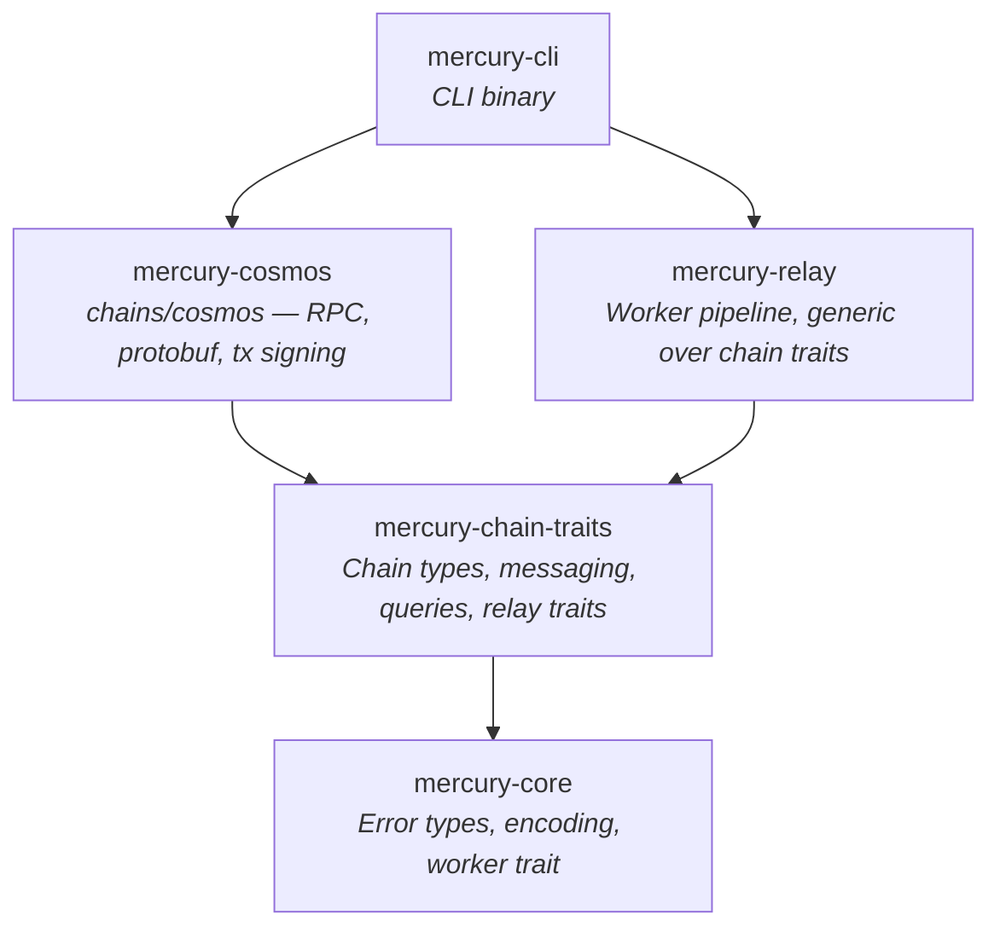
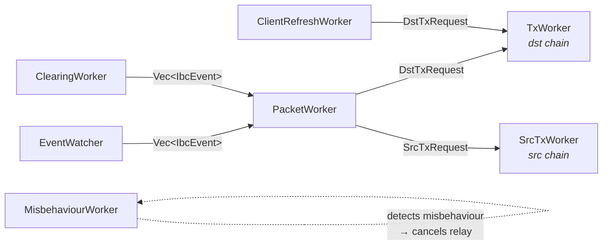

# Architecture

Mercury is an IBC relayer built with plain Rust traits and generics. No macro frameworks, no code generation, no custom programming paradigms.

## Design Principles

- **Direct trait impls.** Every chain operation is a trait method with a direct `impl` block on the concrete type. No provider indirection.
- **Few, focused traits.** ~16 traits grouped by concern instead of 250+ component traits. Type traits are consolidated — `ChainTypes` carries all chain-level types (height, timestamp, messages, chain status, revision number) and `IbcTypes<C>` carries all counterparty-specific types (client state, packets, proofs, acknowledgements). This keeps where clauses short and avoids the "trait per associated type" proliferation that CGP requires.
- **Concrete error type.** One error type based on `eyre::Report` with retryability tracking. No generic error parameters on traits.
- **Struct fields, not trait getters.** Configuration and RPC clients are struct fields accessed via methods. Not abstracted behind traits.

## Trait Hierarchy

### Type Traits

```rust
pub trait ChainTypes: Send + Sync + 'static {
    type Height: Clone + Ord + Debug + Display + Send + Sync + 'static;
    type Timestamp: Clone + Ord + Debug + Send + Sync + 'static;
    type ChainId: Clone + Debug + Display + Send + Sync + 'static;
    type Event: Clone + Debug + Send + Sync + 'static;
    type Message: Send + Sync + 'static;
    type MessageResponse: Send + Sync + 'static;
    type ChainStatus: Send + Sync + 'static;

    fn chain_status_height(status: &Self::ChainStatus) -> &Self::Height;
    fn chain_status_timestamp(status: &Self::ChainStatus) -> &Self::Timestamp;
    fn chain_status_timestamp_secs(status: &Self::ChainStatus) -> u64;
    fn revision_number(&self) -> u64;
    fn increment_height(height: &Self::Height) -> Option<Self::Height>;
}
```

### Counterparty Generics

IBC relaying involves two chains that know about each other's types. Chain A stores a client state *of* chain B. This cross-chain type relationship is modeled with a generic parameter:

```rust
pub trait IbcTypes<Counterparty: ChainTypes + ?Sized>: ChainTypes {
    type ClientId: Clone + Debug + Display + Send + Sync + 'static;
    type ClientState: Clone + Debug + Send + Sync + 'static;
    type ConsensusState: Clone + Debug + Send + Sync + 'static;
    type CommitmentProof: Clone + Send + Sync + 'static;
    type Packet: Clone + Debug + Send + Sync + 'static;
    type PacketCommitment: Send + Sync + 'static;
    type PacketReceipt: Send + Sync + 'static;
    type Acknowledgement: Send + Sync + 'static;

    fn packet_sequence(packet: &Self::Packet) -> u64;
    fn packet_timeout_timestamp(packet: &Self::Packet) -> u64;
}
```

`CosmosChain` implements `IbcTypes<CosmosChain>` for Cosmos-to-Cosmos relaying, and could implement `IbcTypes<CelestiaChain>` with different types for Cosmos-to-Celestia. The compiler prevents mixing up source and destination types.

### Chain Supertrait

`Chain<Counterparty>` bundles the universally required capabilities — any chain participating in IBC must have all of these:

```rust
pub trait Chain<Counterparty>:
    IbcTypes<Counterparty>
    + MessageSender
    + PacketEvents<Counterparty>
    + ChainStatusQuery
    + ClientQuery<Counterparty>
    + PacketStateQuery<Counterparty>
    + ClientPayloadBuilder<Counterparty>
    + ClientMessageBuilder<Counterparty>
    + PacketMessageBuilder<Counterparty>
{}
```

This keeps where clauses focused on only the *additional* bounds each context needs.

### Why Few Traits Instead of Many

CGP decomposes every associated type into its own trait (`HasHeightType`, `HasTimestampType`, `HasMessageType`, `HasChainIdType`, ...) to maximize composability. In practice, you never implement `HasHeightType` without also implementing `HasTimestampType` — they always appear together. The result is where clauses listing 10+ trait bounds that always co-occur.

Mercury consolidates co-occurring types into two traits: `ChainTypes` (chain-local types) and `IbcTypes<C>` (counterparty-dependent types). The split follows a real semantic boundary — chain status doesn't depend on a counterparty, but client state does. Everything within each group is always needed together.

### Trait Groups (~16 total)

- **Type traits** (2) — `ChainTypes`, `IbcTypes<C>`
- **Query traits** (3) — `ChainStatusQuery`, `ClientQuery<C>`, `PacketStateQuery<C>`
- **Builder traits** (3) — `ClientPayloadBuilder<C>`, `ClientMessageBuilder<C>`, `PacketMessageBuilder<C>`
- **Events** (1) — `PacketEvents<C>`
- **Messaging** (1) — `MessageSender`
- **Relay traits** (4) — `Relay`, `BiRelay`, `ClientUpdater`, `RelayPacketBuilder`
- **Infrastructure** (1) — worker

Transaction details (fee estimation, nonce management, tx submission, polling) are concrete methods on `CosmosChain`, not abstract traits — they're implementation details of `MessageSender`, not part of the generic chain abstraction.

## Crate Layout



## Data Flow: Relaying a Packet

Seven workers connected by `tokio::mpsc` channels form the relay pipeline. Each relay direction (A→B, B→A) runs its own set of workers. Shutdown propagates via `CancellationToken` — first worker to exit cancels the rest.



1. **EventWatcher** polls source chain block-by-block for `SendPacket` and `WriteAck` events, batches per block, sends `Vec<IbcEvent>` downstream. Tolerates transient RPC failures without dying.
2. **ClearingWorker** *(optional)* periodically scans source chain for all packet commitments, cross-references against destination receipts, and recovers missed `SendPacket` events. Feeds into the same event channel as EventWatcher. Enabled via `clearing_interval` config.
3. **PacketWorker** receives event batches, classifies packets as live or timed-out using the destination chain's timestamp, queries proofs concurrently with retries, then:
   - Recv/ack messages → `DstTxRequest` → **TxWorker** (destination chain)
   - Timeout messages → `SrcTxRequest` → **SrcTxWorker** (source chain)
4. **ClientRefreshWorker** periodically refreshes the destination client before it expires (sleeps for 1/3 of the trusting period), sends `MsgUpdateClient` via `DstTxRequest`
5. **MisbehaviourWorker** *(optional)* incrementally scans consensus state heights on the destination chain, verifies update headers against the source chain. If conflicting headers are detected, submits `MsgSubmitMisbehaviour` and terminates the relay. Enabled via `misbehaviour_scan_interval` config.
6. **TxWorker** / **SrcTxWorker** accumulate messages, submit batched transactions to their respective chain. Both share the same `run_tx_loop` implementation with semaphore-bounded concurrency (`MAX_IN_FLIGHT=3`) and consecutive failure tracking

## Error Handling

One concrete error type (`mercury-error`) based on `eyre::Report` with retryability tracking:

```rust
pub struct MercuryError {
    inner: eyre::Report,
    retryable: bool,
}

pub type Result<T> = std::result::Result<T, MercuryError>;
```

`Result<T>` uses the project's error type everywhere. No generic error type parameters on traits.

## What's Not Abstracted

Mercury keeps these as direct code rather than trait abstractions:

- **Logging** — uses `tracing` directly
- **Field access** — struct fields accessed via methods
- **Configuration** — config values are struct fields
- **Test infrastructure** — test setup is separate from the core trait hierarchy
- **Transaction internals** — fee estimation, nonce management, tx signing are concrete methods on chain types, not traits
