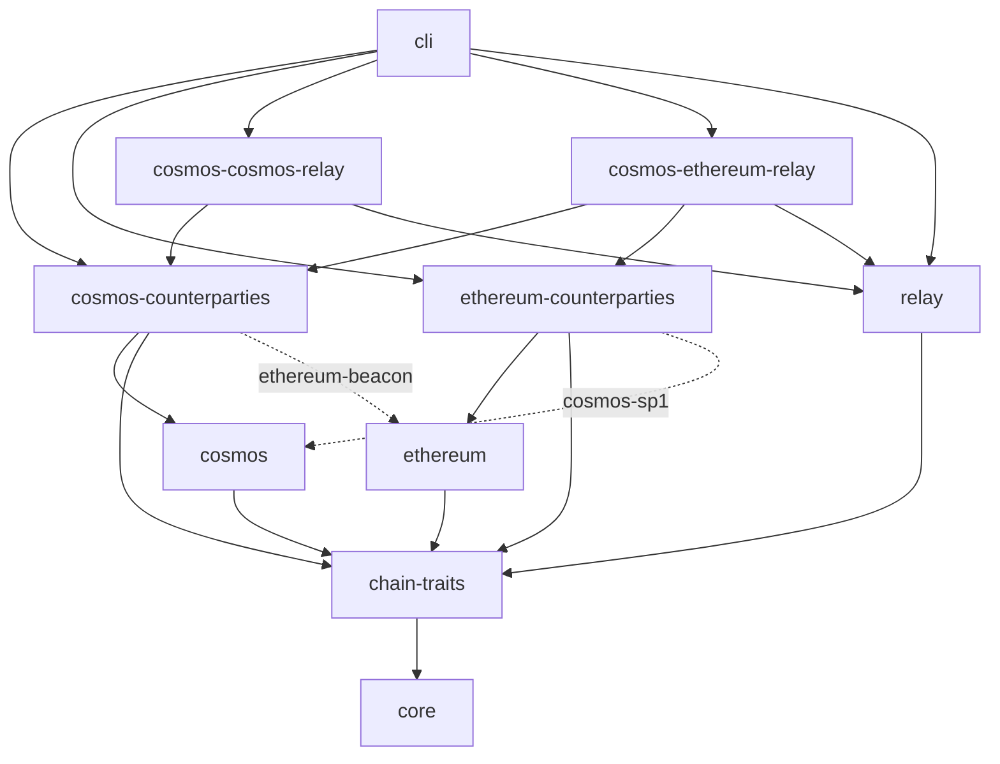
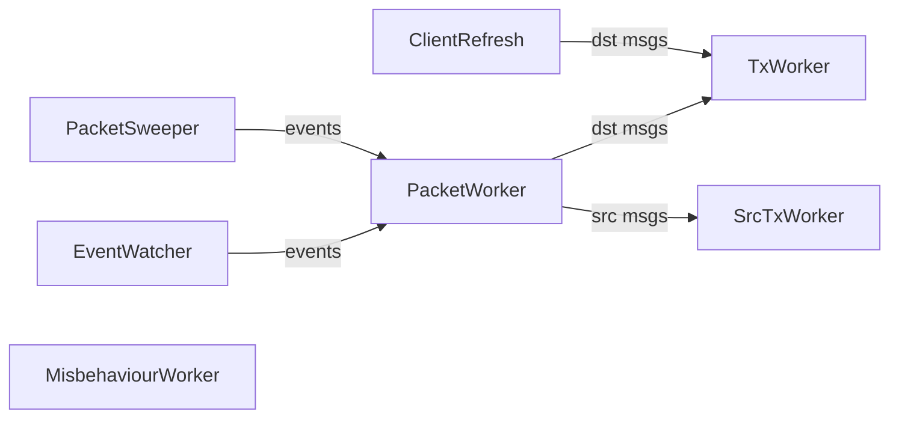

# Architecture

Mercury is an IBC relayer built with plain Rust traits and generics. No macro frameworks, no code generation.

## Design Principles

- **Direct trait impls.** Every chain operation is a trait method with a direct `impl` block. No provider indirection.
- **Few, focused traits.** ~21 traits grouped by concern. `ChainTypes` carries all chain-level types, `IbcTypes` carries all IBC-specific types. Short where clauses.
- **Typed errors with retryability.** `eyre::Result<T>` with four typed error enums (`TxError`, `QueryError`, `ProofError`, `ClientError`) for retryability classification.
- **Struct fields, not trait getters.** Configuration and RPC clients are struct fields, not abstracted behind traits.

## Trait Hierarchy

### Type Traits

`ChainTypes` — height, timestamp, chain ID, client ID, events, messages, chain status. All `ThreadSafe` (`Send + Sync + 'static`).

`IbcTypes: ChainTypes` — client state, consensus state, proofs, packets, acknowledgements. **Non-generic** (no counterparty parameter). Each chain declares its IBC types once regardless of counterparty, eliminating circular dependencies.

### Adapter Pattern

Cross-chain relaying (Cosmos↔EVM) hits Rust's orphan rule. Mercury solves this with:

- **Core type** (e.g., `CosmosChain<S>`) — in the chain's core crate, implements all traits
- **Adapter type** (e.g., `CosmosAdapter<S>`) — in the counterparty crate, wraps core via `HasCore`, adds cross-chain impls

The `delegate_chain!` macro generates all delegation boilerplate. Use `skip_cpb` when the adapter needs a custom `ClientPayloadBuilder`.

### Trait Groups (~21 total)

| Group | Count | Traits |
|-------|-------|--------|
| Type | 3 | `ChainTypes`, `IbcTypes`, `HasCore` |
| Query | 4 | `ChainStatusQuery`, `ClientQuery<C>`, `PacketStateQuery`, `MisbehaviourQuery<C>` |
| Builder | 5 | `ClientPayloadBuilder<C>`, `ClientMessageBuilder<C>`, `PacketMessageBuilder<C>`, `MisbehaviourDetector<C>`, `MisbehaviourMessageBuilder<C>` |
| Events | 1 | `PacketEvents` |
| Messaging | 1 | `MessageSender` |
| Relay | 5 | `Relay`, `BiRelay`, `RelayChain`, `ClientUpdater`, `RelayPacketBuilder` |
| Infra | 2 | `Worker`, `ThreadSafe` |

`RelayChain` bundles universal capabilities: `HasCore + ChainStatusQuery + MessageSender + PacketStateQuery + PacketEvents`. Builder/query traits are bound individually on `Relay` with asymmetric source/destination requirements.

## Cross-Chain Architecture

### Problem

Cosmos→EVM relay: EVM crate needs Cosmos types. If `IbcTypes` were generic, it creates circular crate dependencies.

### Solution

1. **Non-generic `IbcTypes`** — each chain declares IBC types once, no counterparty awareness needed
2. **Adapter pattern** — counterparty crates define local wrapper types that satisfy the orphan rule
3. **Weakened bounds** — `ClientPayloadBuilder` and `ClientMessageBuilder` require only `Counterparty: ChainTypes`, not `IbcTypes`
4. **Type matching at relay site** — `Relay` trait enforces payload type compatibility between producer (src) and consumer (dst)
5. **Feature gates** — cross-chain impls behind `cosmos-sp1` / `ethereum-beacon` features

### Builder Extensibility

`ClientMessageBuilder` has two defaulted hooks for chain-specific customization:
- `enrich_update_payload` — attach proof data before building update messages
- `finalize_batch` — post-process the batch (e.g., combine into a single ZK proof)

Both are no-ops for Cosmos↔Cosmos. The Ethereum bridge uses them for batched ZK proving.

## Plugin Architecture

Chains register into a `ChainRegistry` via plugin traits instead of enum-based dispatch. Adding a new chain requires no CLI modifications.

- **`ChainPlugin`** — per-chain operations (config, connection, queries). Keyed by type string.
- **`RelayPairPlugin`** — relay construction for a `(src_type, dst_type)` pair.
- **`DynRelay`** — type-erased relay runner.

Chains are type-erased via `Arc<dyn Any + Send + Sync>`. Relay plugins downcast to concrete types when building relays.

## Crate Layout

Core chain crates are independent. Counterparty crates add cross-chain impls behind feature flags. Relay-pair crates depend on both counterparty crates and provide `RelayPairPlugin` implementations.

## Data Flow

Seven workers per relay direction, connected by `tokio::mpsc` channels. Shutdown via `CancellationToken`.

1. **EventWatcher** — polls source chain block-by-block for `SendPacket`/`WriteAck`, stays 1 block behind tip
2. **PacketSweeper** *(optional)* — periodic full scan recovering missed packets. Enabled via `sweep_interval`
3. **PacketWorker** — classifies live vs timed-out packets, queries proofs (8 concurrent, 3 retries), builds messages, calls `finalize_batch()`
4. **ClientRefreshWorker** — refreshes destination client at 1/3 trusting period
5. **MisbehaviourWorker** *(optional)* — detects conflicting headers, submits misbehaviour evidence, terminates relay
6. **TxWorker / SrcTxWorker** — batched tx submission with semaphore-bounded concurrency (max 3 in-flight)

## Error Handling

Four typed error enums, each implementing `HasRetryability` (classifies variants as `Retryable` or `Fatal`):

| Error | Retryable | Fatal |
|-------|-----------|-------|
| `TxError` | SequenceMismatch, SimulationFailed, BroadcastFailed, NotConfirmed, OutOfGas | Reverted, InsufficientFunds |
| `QueryError` | Timeout, StaleState | NotFound, Deserialization, UnsupportedType |
| `ProofError` | FetchFailed, ZkProvingFailed, Missing | VerificationFailed |
| `ClientError` | — | Expired, Frozen, NotFound |

Untyped errors (`eyre!`/`bail!`) default to retryable. `RetryableExt` checks retryability through the error chain via `downcast_ref()`.

## What's Not Abstracted

Logging (`tracing`), configuration (struct fields), test infrastructure, and transaction internals (fee estimation, nonce management, batch splitting, tx signing) are concrete implementations, not trait abstractions.
