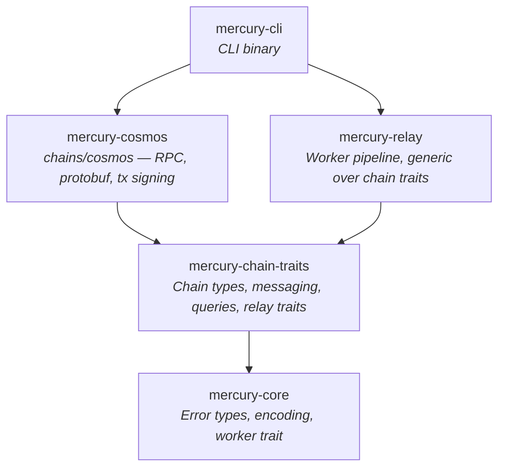
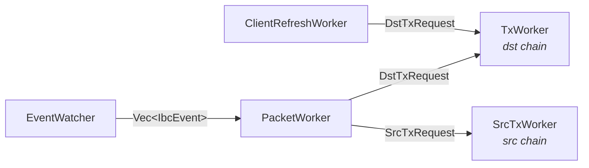

# Architecture

Mercury is an IBC relayer built with plain Rust traits and generics. No macro frameworks, no code generation, no custom programming paradigms.

## Design Principles

- **Direct trait impls.** Every chain operation is a trait method with a direct `impl` block on the concrete type. No provider indirection.
- **Small, focused traits.** ~35 traits grouped by concern instead of 250+ component traits.
- **Concrete error type.** One error type based on `eyre::Report` with retryability tracking. No generic error parameters on traits.
- **Struct fields, not trait getters.** Configuration and RPC clients are struct fields accessed via methods. Not abstracted behind traits.

## Trait Hierarchy

### Type Traits

```rust
pub trait HasChainTypes: Send + Sync + 'static {
    type Height: Clone + Ord + Debug + Display + Send + Sync + 'static;
    type Timestamp: Clone + Ord + Debug + Send + Sync + 'static;
    type ChainId: Clone + Debug + Display + Send + Sync + 'static;
    type Event: Clone + Debug + Send + Sync + 'static;
}

pub trait HasMessageTypes: HasChainTypes {
    type Message: Send + Sync + 'static;
    type MessageResponse: Send + Sync + 'static;
}
```

### Counterparty Generics

IBC relaying involves two chains that know about each other's types. Chain A stores a client state *of* chain B. This cross-chain type relationship is modeled with a generic parameter:

```rust
pub trait HasIbcTypes<Counterparty: HasChainTypes>: HasChainTypes {
    type ClientId: Clone + Debug + Display + Send + Sync + 'static;
    type ClientState: Clone + Debug + Send + Sync + 'static;
    type ConsensusState: Clone + Debug + Send + Sync + 'static;
    type CommitmentProof: Clone + Send + Sync + 'static;
}
```

`CosmosChain` implements `HasIbcTypes<CosmosChain>` for Cosmos-to-Cosmos relaying, and could implement `HasIbcTypes<CelestiaChain>` with different types for Cosmos-to-Celestia. The compiler prevents mixing up source and destination types.

### Chain Supertrait

`Chain<Counterparty>` bundles the universally required capabilities — any chain participating in IBC must have all of these:

```rust
pub trait Chain<Counterparty>:
    HasMessageTypes
    + HasPacketTypes<Counterparty>
    + CanSendMessages
    + CanExtractPacketEvents<Counterparty>
    + CanQueryChainStatus
{}
```

This keeps where clauses focused on only the *additional* bounds each context needs.

### Trait Groups (~35 total)

- **Type traits** (6) — `HasChainTypes`, `HasMessageTypes`, `HasIbcTypes<C>`, `HasPacketTypes<C>`, `HasChainStatusType`, `HasRevisionNumber`
- **Query traits** (7) — chain status, client state, consensus state, client latest height, trusting period, block events, packet commitments/receipts/acks
- **Message builders** (7) — create/update client, register counterparty, recv/ack/timeout packets
- **Payload builders** (2) — create/update client payloads (counterparty side)
- **Transaction traits** (4) — submit, estimate fee, query nonce, poll response
- **Relay traits** (6) — build recv/ack/timeout messages, client update, event relay, bidirectional relay
- **Infrastructure** (2) — encoding, worker

## Crate Layout



## Data Flow: Relaying a Packet

Five workers connected by `tokio::mpsc` channels form the relay pipeline. Each relay direction (A→B, B→A) runs its own set of workers. Shutdown propagates via `CancellationToken` — first worker to exit cancels the rest.



1. **EventWatcher** polls source chain block-by-block for `SendPacket` and `WriteAck` events, batches per block, sends `Vec<IbcEvent>` downstream. Tolerates transient RPC failures without dying.
2. **PacketWorker** receives event batches, classifies packets as live or timed-out using the destination chain's timestamp, queries proofs concurrently with retries, then:
   - Recv/ack messages → `DstTxRequest` → **TxWorker** (destination chain)
   - Timeout messages → `SrcTxRequest` → **SrcTxWorker** (source chain)
3. **ClientRefreshWorker** periodically refreshes the destination client before it expires (sleeps for 1/3 of the trusting period), sends `MsgUpdateClient` via `DstTxRequest`
4. **TxWorker** / **SrcTxWorker** accumulate messages, submit batched transactions to their respective chain. Both share the same `run_tx_loop` implementation with semaphore-bounded concurrency (`MAX_IN_FLIGHT=3`) and consecutive failure tracking

## Error Handling

One concrete error type (`mercury-error`) based on `eyre::Report` with retryability tracking:

```rust
pub struct MercuryError {
    inner: eyre::Report,
    retryable: bool,
}

pub type Result<T> = std::result::Result<T, MercuryError>;
```

`Result<T>` uses the project's error type everywhere. No generic error type parameters on traits.

## What's Not Abstracted

Mercury keeps these as direct code rather than trait abstractions:

- **Logging** — uses `tracing` directly
- **Field access** — struct fields accessed via methods
- **Configuration** — config values are struct fields
- **Test infrastructure** — test setup is separate from the core trait hierarchy
